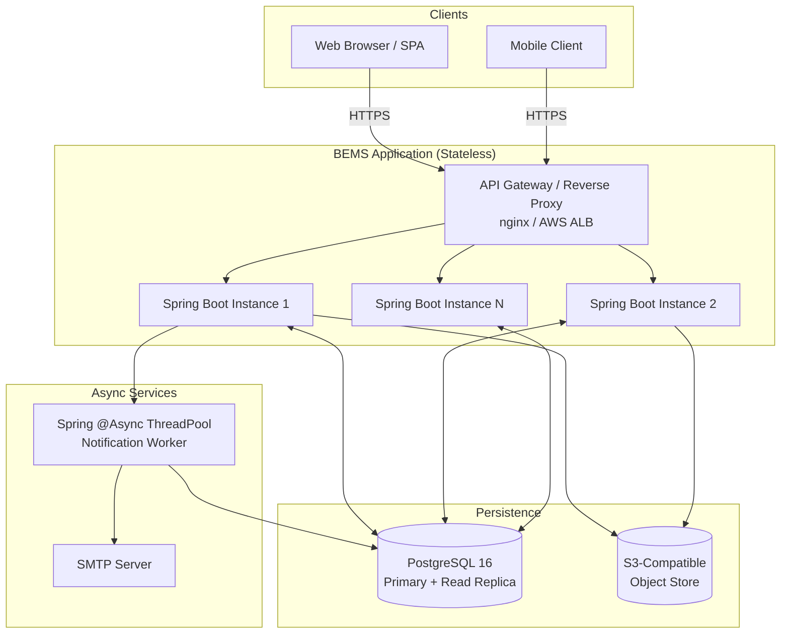
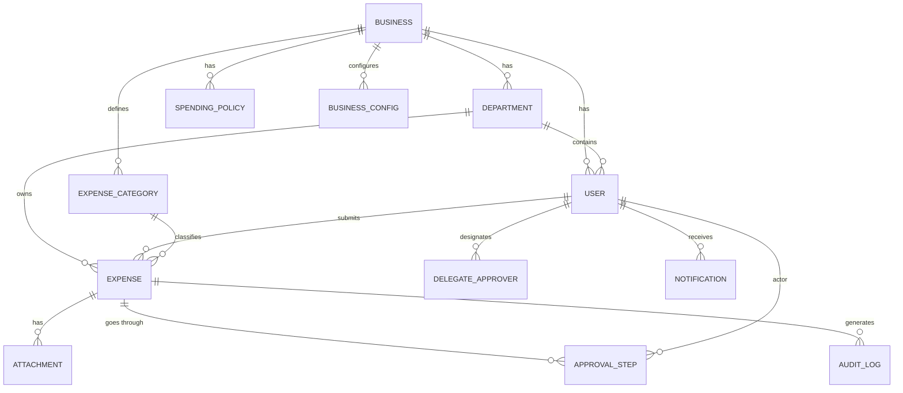

# Design Document: Business Expense Management System (BEMS)

## Overview

The Business Expense Management System (BEMS) is a multi-tenant, production-quality web application built on Java Spring Boot. It manages the full lifecycle of employee expense claims — from submission through multi-level approval, spending policy enforcement, reimbursement, and financial reporting — across any number of independent business tenants sharing a single platform.

### Design Goals

- **Multi-tenancy**: Every data query is scoped to a Business ID. No cross-tenant data leakage is architecturally possible.
- **Stateless scalability**: JWT-based authentication stores no server-side session state, enabling horizontal scaling behind a load balancer.
- **Correctness by design**: The expense lifecycle is modelled as an explicit finite-state machine; invalid transitions are rejected at the domain layer before reaching persistence.
- **Audit completeness**: Every state change, login, and deletion appends an immutable record to the audit log.
- **Resilience**: Notifications are sent asynchronously; failures never roll back the primary transaction.

### Technology Stack

| Layer | Choice | Rationale |
|---|---|---|
| Language | Java 21 (LTS) | Virtual threads (Project Loom) simplify async I/O; strong ecosystem; long support window. |
| Framework | Spring Boot 3.3 | Autoconfiguration, Spring Security 6, Spring Data JPA, Spring Batch for reports. |
| Database | PostgreSQL 16 | ACID transactions, JSONB for audit state snapshots, Row-Level Security hooks, mature JDBC driver. |
| Connection Pool | HikariCP | Default Spring Boot pool; min 5 / max 50 per instance, tuned via `application.yml`. |
| ORM | Spring Data JPA + Hibernate 6 | Entity lifecycle hooks for audit; native queries where performance demands it. |
| Migration | Flyway | Version-controlled schema changes; applied at startup. |
| Security | Spring Security 6 + JJWT 0.12 | Filter-chain–based JWT parsing; BCrypt password hashing. |
| File Storage | Local filesystem (dev) / S3-compatible object store (prod) | Abstracted behind `AttachmentStoragePort`; swap implementation without service changes. |
| Email | Spring Mail + JavaMailSender | SMTP integration; templates via Thymeleaf. |
| Async/Events | Spring `@Async` + `ApplicationEventPublisher` | Decouples notification dispatch from business transactions. |
| Export | Apache POI (XLSX) + OpenPDF (PDF) | Proven libraries; streaming API for large datasets. |
| API Docs | springdoc-openapi 2 | Auto-generates OpenAPI 3.0 from annotations; served at `/api/v1/docs`. |
| Testing – unit | JUnit 5 + Mockito | Standard Spring Boot test slice support. |
| Testing – property | jqwik 1.8 | Property-based testing for JVM; integrates with JUnit 5 platform. |
| Build | Maven (multi-module) | Explicit module boundaries; reproducible builds. |

---

## Architecture

### High-Level Architecture



### Layered Package Architecture (per Module)

```
com.bems
├── application          ← Spring Boot entry point, configuration, security
├── domain               ← Pure Java domain model (entities, value objects, state machine, policies)
│   ├── model
│   ├── statemachine
│   ├── policy
│   └── port             ← Interfaces the domain depends on (repository ports, storage port)
├── usecase              ← Application services / use-case orchestrators
│   ├── expense
│   ├── user
│   ├── report
│   └── notification
├── adapter
│   ├── web              ← REST controllers, request/response DTOs, global exception handler
│   ├── persistence      ← JPA repositories, entity mappers, Flyway migrations
│   ├── storage          ← File storage adapter (local / S3)
│   ├── mail             ← Email adapter
│   └── export           ← PDF / XLSX report adapters
└── shared               ← Cross-cutting utilities (audit, pagination, error codes)
```

This is a **Ports and Adapters (Hexagonal)** architecture. The `domain` and `usecase` layers have zero dependencies on Spring or JPA — they depend only on interfaces defined in `domain/port`. This makes the domain fully unit-testable without an application context.

### Module Boundaries

```
bems-parent (Maven POM aggregator)
├── bems-domain          (pure Java, no framework deps)
├── bems-application     (Spring Boot, wires adapters)
└── bems-integration-test (Testcontainers, end-to-end)
```

---

## Components and Interfaces

### REST Controller Layer (`adapter/web`)

Each controller maps to a domain aggregate and delegates immediately to a use-case service. Controllers are responsible for:
- Extracting the authenticated principal from the security context.
- Mapping HTTP request DTOs → domain input objects.
- Mapping domain output objects → HTTP response DTOs.
- No business logic resides in controllers.

| Controller | Base Path | Primary Responsibilities |
|---|---|---|
| `BusinessController` | `/api/v1/businesses` | CRUD for Business tenants (Platform_Super_Admin only) |
| `UserController` | `/api/v1/users` | User management (Admin, Business_Owner) |
| `DepartmentController` | `/api/v1/departments` | Department management |
| `CategoryController` | `/api/v1/categories` | Expense category management |
| `PolicyController` | `/api/v1/policies` | Spending policy management |
| `ExpenseController` | `/api/v1/expenses` | Submit, edit, approve, reject, delete |
| `ApprovalController` | `/api/v1/expenses/{id}/approvals` | Approve / reject / override actions |
| `ReimbursementController` | `/api/v1/expenses/{id}/reimbursements` | Mark as reimbursed |
| `DelegateController` | `/api/v1/delegates` | Delegate approver management |
| `NotificationController` | `/api/v1/notifications` | In-app notification list and mark-as-read |
| `ReportController` | `/api/v1/reports` | Report queries and export (PDF/XLSX) |
| `AuditController` | `/api/v1/audit` | Audit log queries |
| `AuthController` | `/api/v1/auth` | Login, refresh, logout, password reset |
| `DashboardController` | `/api/v1/dashboard` | Role-specific dashboard metrics |

### Use-Case Service Layer (`usecase`)

Services are thin orchestrators. A service method:
1. Loads aggregates via repository ports.
2. Invokes domain logic (state machine, policy checks).
3. Persists changes via repository ports.
4. Publishes a domain event for async notification dispatch.

```java
// Example interface contract
public interface ExpenseSubmissionUseCase {
    ExpenseDto submitExpense(SubmitExpenseCommand command, AuthenticatedUser actor);
}
```

### Domain Ports (`domain/port`)

```java
public interface ExpenseRepository {
    Expense save(Expense expense);
    Optional<Expense> findById(UUID id, UUID businessId);
    List<Expense> findPendingForApprover(UUID approverId, UUID businessId);
    // ...
}

public interface AttachmentStoragePort {
    String store(UUID businessId, UUID expenseId, byte[] content, String mimeType);
    byte[] retrieve(String storageKey);
    void delete(String storageKey);
}

public interface NotificationPort {
    void sendInApp(UUID recipientId, NotificationPayload payload);
    void sendEmail(String recipientEmail, NotificationPayload payload);
}
```

### Global Exception Handler

```java
@RestControllerAdvice
public class GlobalExceptionHandler {
    // Maps domain exceptions → standard error response
    // Maps ConstraintViolationException → 400 with field-level errors
    // Maps AccessDeniedException → 403
    // Maps EntityNotFoundException → 404
    // Catches Throwable → 500 with correlation ID
}
```

---

## Data Models

### Entity Relationship Overview



### Core Table Definitions

#### `businesses`

| Column | Type | Notes |
|---|---|---|
| `id` | UUID PK | Generated |
| `name` | VARCHAR(255) UNIQUE NOT NULL | |
| `country` | VARCHAR(100) NOT NULL | |
| `currency_code` | CHAR(3) NOT NULL | ISO 4217 |
| `contact_email` | VARCHAR(255) NOT NULL | |
| `status` | VARCHAR(20) NOT NULL | `ACTIVE` / `INACTIVE` |
| `created_at` | TIMESTAMPTZ NOT NULL | |
| `updated_at` | TIMESTAMPTZ | |
| `deleted_at` | TIMESTAMPTZ | Soft delete |
| `deleted_by` | UUID FK→users | |

#### `users`

| Column | Type | Notes |
|---|---|---|
| `id` | UUID PK | |
| `business_id` | UUID FK→businesses NOT NULL | Tenant scope |
| `department_id` | UUID FK→departments | |
| `full_name` | VARCHAR(255) NOT NULL | PII column |
| `email` | VARCHAR(255) NOT NULL | PII column; unique per business |
| `password_hash` | VARCHAR(255) NOT NULL | BCrypt |
| `role` | VARCHAR(50) NOT NULL | Enum |
| `status` | VARCHAR(20) NOT NULL | `ACTIVE` / `INACTIVE` / `LOCKED` |
| `data_subject_id` | UUID | GDPR linkage |
| `failed_login_count` | SMALLINT DEFAULT 0 | |
| `locked_until` | TIMESTAMPTZ | Account lockout |
| `activation_token` | VARCHAR(255) | One-time; 48h TTL |
| `activation_expires_at` | TIMESTAMPTZ | |
| `created_at` | TIMESTAMPTZ NOT NULL | |
| `deleted_at` | TIMESTAMPTZ | |
| `deleted_by` | UUID FK→users | |

**Indexes:** `(business_id, email)` UNIQUE WHERE `deleted_at IS NULL`; `(business_id, role)`.

#### `departments`

| Column | Type | Notes |
|---|---|---|
| `id` | UUID PK | |
| `business_id` | UUID FK NOT NULL | |
| `name` | VARCHAR(255) NOT NULL | Unique per business |
| `description` | TEXT | |
| `status` | VARCHAR(20) | `ACTIVE` / `INACTIVE` |
| `created_at` | TIMESTAMPTZ | |
| `deleted_at` | TIMESTAMPTZ | |
| `deleted_by` | UUID FK→users | |

#### `expense_categories`

| Column | Type | Notes |
|---|---|---|
| `id` | UUID PK | |
| `business_id` | UUID FK NOT NULL | |
| `name` | VARCHAR(255) NOT NULL | |
| `description` | TEXT | |
| `per_transaction_limit` | NUMERIC(15,2) | NULL = no limit |
| `status` | VARCHAR(20) | `ACTIVE` / `INACTIVE` |
| `created_at` | TIMESTAMPTZ | |
| `deleted_at` | TIMESTAMPTZ | |
| `deleted_by` | UUID FK→users | |

#### `spending_policies`

| Column | Type | Notes |
|---|---|---|
| `id` | UUID PK | |
| `business_id` | UUID FK NOT NULL | |
| `policy_type` | VARCHAR(30) NOT NULL | `EMPLOYEE_MONTHLY` / `DEPARTMENT_MONTHLY` |
| `target_id` | UUID NOT NULL | Employee ID or Department ID |
| `monthly_limit` | NUMERIC(15,2) NOT NULL | |
| `created_at` | TIMESTAMPTZ | |
| `updated_at` | TIMESTAMPTZ | |

**Constraint:** UNIQUE `(business_id, policy_type, target_id)`.

#### `expenses`

| Column | Type | Notes |
|---|---|---|
| `id` | UUID PK | |
| `business_id` | UUID FK NOT NULL | Denormalised for query performance |
| `submitter_id` | UUID FK→users NOT NULL | |
| `department_id` | UUID FK→departments NOT NULL | Snapshot at submission time |
| `category_id` | UUID FK→expense_categories NOT NULL | |
| `title` | VARCHAR(255) NOT NULL | |
| `amount` | NUMERIC(15,2) NOT NULL | Positive |
| `expense_date` | DATE NOT NULL | |
| `description` | TEXT | |
| `status` | VARCHAR(30) NOT NULL | State machine enum |
| `approval_tier` | VARCHAR(20) NOT NULL | `MANAGER_ONLY` / `MANAGER_ACCOUNTANT` / `MANAGER_ACCOUNTANT_OWNER` |
| `current_approver_id` | UUID FK→users | Active approver |
| `is_escalated` | BOOLEAN DEFAULT FALSE | |
| `resubmission_count` | SMALLINT DEFAULT 0 | |
| `last_resubmitted_at` | TIMESTAMPTZ | |
| `submitted_at` | TIMESTAMPTZ | |
| `payment_reference` | VARCHAR(255) | Reimbursement |
| `payment_method` | VARCHAR(100) | |
| `payment_date` | DATE | |
| `reimbursed_at` | TIMESTAMPTZ | |
| `reimbursed_by` | UUID FK→users | |
| `created_at` | TIMESTAMPTZ NOT NULL | |
| `updated_at` | TIMESTAMPTZ | |
| `deleted_at` | TIMESTAMPTZ | |
| `deleted_by` | UUID FK→users | |

**Indexes:** `(business_id, status)`, `(business_id, submitter_id)`, `(business_id, department_id, status)`, `(current_approver_id)` PARTIAL WHERE `deleted_at IS NULL`.

#### `approval_steps`

Append-only table recording every approval decision.

| Column | Type | Notes |
|---|---|---|
| `id` | UUID PK | |
| `expense_id` | UUID FK NOT NULL | |
| `approver_id` | UUID FK→users NOT NULL | |
| `approver_role` | VARCHAR(50) NOT NULL | Snapshot |
| `action` | VARCHAR(20) NOT NULL | `APPROVED` / `REJECTED` / `OVERRIDDEN` |
| `comment` | TEXT | Mandatory for rejection/override |
| `acted_at` | TIMESTAMPTZ NOT NULL | |
| `step_order` | SMALLINT NOT NULL | Position in chain |

**No UPDATE or DELETE ever issued on this table.**

#### `attachments`

| Column | Type | Notes |
|---|---|---|
| `id` | UUID PK | |
| `expense_id` | UUID FK NOT NULL | |
| `business_id` | UUID FK NOT NULL | |
| `original_filename` | VARCHAR(255) | |
| `mime_type` | VARCHAR(100) NOT NULL | Validated |
| `file_size_bytes` | BIGINT NOT NULL | |
| `storage_key` | VARCHAR(512) NOT NULL | Object store path |
| `uploaded_by` | UUID FK→users | |
| `uploaded_at` | TIMESTAMPTZ NOT NULL | |
| `deleted_at` | TIMESTAMPTZ | |
| `deleted_by` | UUID FK→users | |

#### `delegate_approvers`

| Column | Type | Notes |
|---|---|---|
| `id` | UUID PK | |
| `business_id` | UUID FK NOT NULL | |
| `manager_id` | UUID FK→users NOT NULL | |
| `delegate_id` | UUID FK→users NOT NULL | Must be same business |
| `start_date` | DATE NOT NULL | Delegation starts 00:00:00 UTC |
| `end_date` | DATE NOT NULL | Delegation ends 23:59:59 UTC |
| `is_active` | BOOLEAN DEFAULT TRUE | Set to false by scheduler |
| `created_at` | TIMESTAMPTZ | |

**Constraint:** `start_date <= end_date`.

#### `notifications`

| Column | Type | Notes |
|---|---|---|
| `id` | UUID PK | |
| `business_id` | UUID FK NOT NULL | |
| `recipient_id` | UUID FK→users NOT NULL | |
| `type` | VARCHAR(50) NOT NULL | `EXPENSE_SUBMITTED`, `APPROVED`, `REJECTED`, etc. |
| `title` | VARCHAR(255) | |
| `body` | TEXT | |
| `reference_entity_type` | VARCHAR(50) | `EXPENSE` etc. |
| `reference_entity_id` | UUID | |
| `is_read` | BOOLEAN DEFAULT FALSE | |
| `read_at` | TIMESTAMPTZ | |
| `created_at` | TIMESTAMPTZ NOT NULL | |

**Index:** `(recipient_id, is_read)` WHERE `deleted_at IS NULL`.

#### `audit_log`

| Column | Type | Notes |
|---|---|---|
| `id` | UUID PK | |
| `business_id` | UUID | NULL for platform-level actions |
| `entity_type` | VARCHAR(50) NOT NULL | |
| `entity_id` | UUID NOT NULL | |
| `action_type` | VARCHAR(50) NOT NULL | `CREATE` / `UPDATE` / `STATUS_CHANGE` / `LOGIN` / `LOGOUT` / `SOFT_DELETE` |
| `actor_id` | UUID FK→users NOT NULL | |
| `actor_role` | VARCHAR(50) NOT NULL | Snapshot |
| `previous_state` | JSONB | |
| `new_state` | JSONB | |
| `timestamp` | TIMESTAMPTZ NOT NULL | |
| `pii_accessed` | BOOLEAN DEFAULT FALSE | GDPR flag |

**No UPDATE or DELETE ever issued on this table. Partition by `timestamp` for 7-year retention management.**

#### `refresh_tokens`

| Column | Type | Notes |
|---|---|---|
| `id` | UUID PK | |
| `user_id` | UUID FK→users NOT NULL | |
| `token_hash` | VARCHAR(512) NOT NULL | SHA-256 of raw token |
| `expires_at` | TIMESTAMPTZ NOT NULL | |
| `revoked_at` | TIMESTAMPTZ | NULL = valid |
| `created_at` | TIMESTAMPTZ NOT NULL | |

#### `business_configs`

Stores per-business configurable parameters.

| Column | Type | Notes |
|---|---|---|
| `id` | UUID PK | |
| `business_id` | UUID FK UNIQUE NOT NULL | |
| `escalation_threshold_days` | SMALLINT DEFAULT 7 | |
| `updated_at` | TIMESTAMPTZ | |

---

## Key Design Patterns

### 1. Expense State Machine

The expense lifecycle is a **deterministic finite automaton** implemented in `domain/statemachine/ExpenseStateMachine`. Transitions are enumerated in a static map; any attempt to apply an unlisted transition throws `InvalidStateTransitionException` (mapped to HTTP 400).

```java
public enum ExpenseStatus {
    DRAFT, SUBMITTED, MANAGER_APPROVED, ACCOUNTANT_APPROVED,
    FULLY_APPROVED, REIMBURSED, REJECTED
}

// Allowed transitions: source → Set<target>
private static final Map<ExpenseStatus, Set<ExpenseStatus>> TRANSITIONS = Map.of(
    DRAFT,               Set.of(SUBMITTED),
    SUBMITTED,           Set.of(MANAGER_APPROVED, REJECTED),
    MANAGER_APPROVED,    Set.of(ACCOUNTANT_APPROVED, FULLY_APPROVED, REJECTED),
    ACCOUNTANT_APPROVED, Set.of(FULLY_APPROVED, REJECTED),
    FULLY_APPROVED,      Set.of(REIMBURSED),
    REJECTED,            Set.of(SUBMITTED)   // resubmission
);

public ExpenseStatus transition(ExpenseStatus from, ExpenseStatus to) {
    if (!TRANSITIONS.getOrDefault(from, Set.of()).contains(to)) {
        throw new InvalidStateTransitionException(from, to);
    }
    return to;
}
```

**Approval tier shortcut logic** is applied immediately after Manager approval:
- Amount < ₹5,000 → skip directly to `FULLY_APPROVED`.
- Amount ₹5,000–₹50,000 after `ACCOUNTANT_APPROVED` → skip directly to `FULLY_APPROVED`.

### 2. Approval Chain Strategy Pattern

The `ApprovalChainStrategy` interface determines the ordered list of approver roles required for a given expense amount. Three concrete strategies are registered as Spring beans:

```java
public interface ApprovalChainStrategy {
    boolean supports(BigDecimal amount);
    List<ApproverRole> chain();
}

@Component class ManagerOnlyStrategy    implements ApprovalChainStrategy { ... } // < 5000
@Component class ManagerAccountantStrategy implements ApprovalChainStrategy { ... } // 5000–50000
@Component class FullChainStrategy      implements ApprovalChainStrategy { ... } // > 50000
```

A `ApprovalChainResolver` iterates the list in order and returns the first matching strategy.

### 3. Spending Policy Enforcement (Chain of Responsibility)

Before an expense is persisted as `SUBMITTED`, a `SpendingPolicyChain` executes three validators in sequence:

1. `CategoryLimitValidator` — checks per-transaction category cap.
2. `EmployeeMonthlyLimitValidator` — sums approved + pending for current month for the employee.
3. `DepartmentMonthlyLimitValidator` — sums approved + pending for current month for the department.

Each validator throws `SpendingPolicyViolationException` with the applicable limit, current total, and overage.

### 4. Tenant Isolation (Spring Data filter)

A `@TenantAware` annotation on repositories activates a Hibernate `TenantFilter` that appends `WHERE business_id = :currentBusinessId` to every query. The business ID is extracted from the JWT and stored in a request-scoped `TenantContext` thread-local.

```java
@FilterDef(name = "tenantFilter", parameters = @ParamDef(name = "businessId", type = UUID.class))
@Filter(name = "tenantFilter", condition = "business_id = :businessId")
@Entity public class Expense { ... }
```

### 5. Delegate Approver UTC Enforcement

When the system evaluates whether a delegate is active, it computes:

```java
Instant now = Instant.now(); // UTC
LocalDate todayUtc = now.atZone(ZoneOffset.UTC).toLocalDate();
boolean active = !todayUtc.isBefore(delegation.getStartDate())
              && !todayUtc.isAfter(delegation.getEndDate());
```

A scheduled job (`@Scheduled(cron = "0 0 0 * * *")`) sets `is_active = false` for all delegations whose `end_date < today UTC`.

### 6. Append-Only Audit Log

`AuditLogAspect` is an `@AfterReturning` AOP aspect on all `@AuditableAction`-annotated service methods. It serialises the before/after entity state to JSONB using Jackson and inserts directly via a `JdbcTemplate` INSERT (bypassing JPA to guarantee no merge/update path exists).

### 7. File Attachment Validation (MIME + Magic Bytes)

```java
public class AttachmentValidator {
    private static final Map<String, byte[]> MAGIC = Map.of(
        "application/pdf", new byte[]{0x25, 0x50, 0x44, 0x46},
        "image/jpeg",      new byte[]{(byte)0xFF, (byte)0xD8, (byte)0xFF},
        "image/png",       new byte[]{(byte)0x89, 0x50, 0x4E, 0x47}
    );

    public void validate(MultipartFile file) {
        String declared = file.getContentType();       // MIME from Content-Type header
        byte[] header = file.getBytes();               // read first bytes
        byte[] magic = detectMagic(header);
        if (!matches(declared, magic)) {
            throw new InvalidAttachmentException("File type mismatch");
        }
        if (file.getSize() > 10 * 1024 * 1024) {
            throw new InvalidAttachmentException("File exceeds 10 MB limit");
        }
    }
}
```

Both checks must pass. The file extension is not trusted.

---

## Security Design

### JWT Filter Chain

```
Request
  │
  ▼
CorsFilter               ← CORS headers; allowed origins from config
  │
  ▼
JwtAuthenticationFilter  ← Extracts Bearer token; validates signature + expiry
  │                         Loads UserDetails; sets SecurityContext
  ▼
TenantContextFilter      ← Extracts business_id claim; populates TenantContext
  │
  ▼
RoleBasedAuthorizationFilter (via @PreAuthorize / method security)
  │
  ▼
Controller
```

**Token Structure (Access JWT):**
```json
{
  "sub": "user-uuid",
  "bid": "business-uuid",
  "role": "MANAGER",
  "iat": 1700000000,
  "exp": 1700000900
}
```

**Refresh token**: opaque UUID stored in DB as SHA-256 hash; returned as `HttpOnly` cookie. Rotation on every refresh.

### RBAC Implementation

Spring Method Security with custom `@PreAuthorize` expressions:

```java
@PreAuthorize("hasRole('ADMIN') and @tenantGuard.isSameBusiness(#dto.businessId, authentication)")
public UserDto createUser(CreateUserDto dto) { ... }

@PreAuthorize("hasAnyRole('MANAGER','BUSINESS_OWNER') and @expenseGuard.canApprove(#expenseId, authentication)")
public void approveExpense(UUID expenseId, ApprovalDto dto) { ... }
```

`TenantGuard` and `ExpenseGuard` are Spring beans that perform database-backed permission checks when annotations alone are insufficient. The result is never cached across requests (Requirement 17.3).

### Authentication Rate Limiting

A `RateLimitingFilter` tracks login attempts per IP using a `ConcurrentHashMap<String, AtomicInteger>`. Entries expire via a `@Scheduled` cleanup. Maximum 10 attempts per IP per minute; exceeding returns HTTP 429.

Account-level lockout: 5 consecutive failures → `locked_until = now + 15 minutes` persisted to DB.

### Password Policy

Password validation uses a `PasswordPolicyValidator` that checks all five criteria simultaneously and returns a set of failed criteria (not short-circuit). This ensures the error response always lists every unmet requirement.

### HTTPS Enforcement

In production, the embedded server (Tomcat) listens on HTTPS only. An `HttpToHttpsRedirectFilter` (or nginx `return 301`) handles HTTP→HTTPS redirect.

### Input Sanitisation

All string inputs are trimmed and validated via Bean Validation (`@NotBlank`, `@Size`, `@Pattern`). SQL injection is prevented structurally via parameterised JPA queries. XSS-risky fields (`description`, `title`) are HTML-escaped before persistence using OWASP Java Encoder.

---

## Notification Design

### Async Event-Driven Architecture

Notifications are completely decoupled from business transactions. The pattern:

1. A use-case service publishes a `DomainEvent` (e.g., `ExpenseSubmittedEvent`) via `ApplicationEventPublisher`.
2. `@TransactionalEventListener(phase = AFTER_COMMIT)` ensures the event fires only after the DB transaction commits successfully.
3. The `NotificationEventHandler` runs on a dedicated `@Async` thread pool (`notification-pool`, 5–20 threads).
4. For each event, it dispatches both in-app (`notifications` table INSERT) and email (`JavaMailSender`).
5. **Failure handling**: if email sending throws, the exception is caught, the failure is logged to a `notification_failures` table with retry metadata, and processing continues. The originating business transaction is never rolled back.
6. A `@Scheduled` retry job replays failed notifications up to 3 times with exponential back-off.

```
Business Transaction (commits)
    │
    └─► ApplicationEventPublisher.publishEvent(ExpenseSubmittedEvent)
              │
              └─► @TransactionalEventListener (AFTER_COMMIT)
                        │
                        └─► @Async NotificationHandler
                                  ├── INSERT notifications (in-app)
                                  └── JavaMailSender.send() ──► SMTP
                                        └── on failure: log to notification_failures
```

### Notification Types

| Event | Recipients | Channel |
|---|---|---|
| Expense submitted | First approver in chain | In-app + Email |
| Expense approved (intermediate) | Next approver in chain | In-app + Email |
| Expense fully approved | Submitting employee | In-app + Email |
| Expense rejected | Submitting employee | In-app + Email |
| Expense reimbursed | Submitting employee | In-app + Email |
| Escalation triggered | Admin + Business_Owner | In-app + Email |
| Account locked | Locked user | Email |
| Activation link | New user | Email |

---

## File Storage Design

### Abstraction

`AttachmentStoragePort` decouples storage from business logic:

```java
public interface AttachmentStoragePort {
    StorageResult store(AttachmentUploadRequest request);
    InputStream retrieve(String storageKey);
    void delete(String storageKey);
}
```

Two adapters:
- `LocalFileSystemStorageAdapter` — dev/test; stores under `${bems.storage.local.base-path}/{businessId}/{expenseId}/`.
- `S3StorageAdapter` — production; uses AWS SDK v2. Key structure: `{businessId}/{expenseId}/{uuid}.{ext}`. Pre-signed URLs served to clients (1-hour expiry).

### Validation Pipeline

```
MultipartFile received
    │
    ▼
AttachmentValidator.validate()
    ├── size check (≤ 10 MB)
    ├── MIME type header check (PDF / JPEG / PNG)
    └── magic bytes check
    │
    ▼ (passes)
AttachmentStoragePort.store()
    │
    ▼
attachment record inserted (storage_key persisted)
```

---

## Reporting and Export Design

### Query Layer

Reports are backed by native SQL or JPQL queries using Spring Data JPA projections. Large reports use cursor-based pagination or streaming queries to avoid loading 10,000 rows into heap at once.

### Export Pipeline

```
ReportController.exportPdf() or exportXlsx()
    │
    ▼
ReportQueryService.fetchPage() ─ streams rows in pages of 500
    │
    ▼
ReportExportPort (interface)
    ├── PdfReportAdapter (OpenPDF, streamed line-by-line)
    └── XlsxReportAdapter (Apache POI SXSSFWorkbook — streaming API, row flush every 100)
    │
    ▼
StreamingResponseBody written to HttpServletResponse OutputStream
```

`SXSSFWorkbook` (streaming XLSX) keeps at most 100 rows in memory, flushing to disk. This ensures the 10,000-record / 10-second SLA is met while staying within JVM heap.

PDF generation uses OpenPDF's `PdfWriter` with `PdfDocument` streaming; tables are written incrementally.

**Content-Disposition header**: `attachment; filename="report-{timestamp}.{ext}"`.

---

## Error Handling

### Standard Error Response

```json
{
  "status": 400,
  "errorCode": "INVALID_STATE_TRANSITION",
  "message": "Cannot transition expense from SUBMITTED to REIMBURSED",
  "timestamp": "2024-11-15T10:30:00Z",
  "correlationId": "f3a9b2c1-..."
}
```

### Exception Hierarchy

```
BemsException (base)
├── InvalidStateTransitionException       → HTTP 400
├── SpendingPolicyViolationException      → HTTP 422 (with detail fields)
├── InvalidAttachmentException            → HTTP 400
├── ResourceNotFoundException             → HTTP 404
├── AccessDeniedException (Spring)        → HTTP 403
├── TenantIsolationViolationException     → HTTP 403
├── AccountLockedException               → HTTP 423
└── UnhandledException (catch-all)        → HTTP 500 + correlation ID
```

Correlation IDs are generated via `UUID.randomUUID()` and included in both the response body and the MDC log context (`correlationId` field), enabling end-to-end log tracing.

### Validation Errors (HTTP 400)

```json
{
  "status": 400,
  "errorCode": "VALIDATION_FAILED",
  "message": "Request validation failed",
  "timestamp": "...",
  "fieldErrors": [
    {"field": "amount", "message": "must be greater than 0"},
    {"field": "expenseDate", "message": "must not be null"}
  ]
}
```

---

## Correctness Properties

*A property is a characteristic or behavior that should hold true across all valid executions of a system — essentially, a formal statement about what the system should do. Properties serve as the bridge between human-readable specifications and machine-verifiable correctness guarantees.*

**Property Reflection (Redundancy Analysis):**

Before writing final properties, redundant candidates were identified and consolidated:

- Requirements 6.5 and 12.1/12.2 both concern approval chain routing and state machine transitions. They are combined into two complementary properties: one for transition validity, one for approval tier determination.
- Requirements 6.3 and 22.5 both concern attachment file validation (MIME + magic bytes). Combined into a single attachment validation property.
- Requirement 5.3 and 5.4 share the same enforcement pattern (sum of pending+approved vs. limit). Both are kept because they test different dimensions (employee vs. department), but the test structure is identical.
- Requirements 18.1 and 18.2 about audit completeness can be combined into one comprehensive audit record property.
- Requirements 19.1 and 19.2 about soft delete are complementary and kept separate (one tests the record state, one tests query exclusion).

---

### Property 1: Business Creation Invariants

*For any* valid business registration input, the created business record SHALL have a non-null, globally unique Business ID and its status SHALL be set to `ACTIVE` immediately upon creation.

**Validates: Requirements 1.2**

---

### Property 2: Multi-Tenant Data Isolation

*For any* two distinct businesses B1 and B2, and for any data record (expense, user, department, category, or policy) belonging to B1, a query executed with B2's tenant context SHALL never return that record.

**Validates: Requirements 1.5**

---

### Property 3: Business Deactivation Blocks All Tenant Users

*For any* business that is deactivated, and for any user belonging to that business, every authentication attempt by those users SHALL be rejected until the business is reactivated.

**Validates: Requirements 1.4**

---

### Property 4: Single Active Business Owner Invariant

*For any* business at any point in time, the count of users with role `BUSINESS_OWNER` and status `ACTIVE` SHALL be at most 1.

**Validates: Requirements 2.7**

---

### Property 5: User Activation Token Invariant

*For any* newly created user account, the user record SHALL have a non-null activation token and an expiry timestamp that is exactly 48 hours (±1 minute tolerance for processing) after the creation timestamp.

**Validates: Requirements 2.2**

---

### Property 6: Pending Expense Reassignment on Approver Deactivation

*For any* approver user who has pending expenses awaiting their approval, deactivating that approver SHALL result in every one of those pending expenses being reassigned to the next approver in the approval chain, or to the Business_Owner if no subsequent approver exists in the chain.

**Validates: Requirements 2.6**

---

### Property 7: Approval Tier Determination by Amount

*For any* expense amount A:
- If A < 5,000, the approval tier SHALL be `MANAGER_ONLY`.
- If 5,000 ≤ A ≤ 50,000, the approval tier SHALL be `MANAGER_ACCOUNTANT`.
- If A > 50,000, the approval tier SHALL be `MANAGER_ACCOUNTANT_OWNER`.

These three cases partition the entire positive real number line; every positive amount maps to exactly one tier.

**Validates: Requirements 6.5, 12.1, 12.2, 12.3**

---

### Property 8: Expense State Machine Transition Validity

*For any* expense in status S and any attempted target status T, the transition SHALL succeed if and only if the pair (S, T) is in the following allowed set:

`{(DRAFT→SUBMITTED), (SUBMITTED→MANAGER_APPROVED), (SUBMITTED→REJECTED), (MANAGER_APPROVED→ACCOUNTANT_APPROVED), (MANAGER_APPROVED→FULLY_APPROVED), (MANAGER_APPROVED→REJECTED), (ACCOUNTANT_APPROVED→FULLY_APPROVED), (ACCOUNTANT_APPROVED→REJECTED), (FULLY_APPROVED→REIMBURSED), (REJECTED→SUBMITTED)}`

*For any* pair not in this set, the system SHALL reject the transition with HTTP 400.

**Validates: Requirements 12.1, 12.4**

---

### Property 9: Employee Monthly Spending Limit Enforcement

*For any* employee with a configured monthly spending limit L, and any set of existing approved and pending expenses for the current calendar month summing to S, submitting a new expense of amount A SHALL be rejected if and only if S + A > L. When rejected, the error response SHALL contain the applicable limit L, the current total S, and the overage (S + A − L).

**Validates: Requirements 5.3, 5.5**

---

### Property 10: Department Monthly Budget Enforcement

*For any* department with a configured monthly budget B, and any set of existing approved and pending expenses for the current calendar month across all employees in that department summing to S, submitting a new expense of amount A SHALL be rejected if and only if S + A > B. When rejected, the error response SHALL contain the applicable limit B, the current total S, and the overage.

**Validates: Requirements 5.4, 5.5**

---

### Property 11: Attachment Validation (MIME + Magic Bytes)

*For any* uploaded file, the upload SHALL be accepted if and only if both of the following conditions hold:
1. The file's magic bytes match one of the allowed types: PDF (`%PDF`), JPEG (`FF D8 FF`), PNG (`89 50 4E 47`).
2. The file size is ≤ 10,485,760 bytes (10 MiB).

*For any* file where the declared MIME type does not match the detected magic bytes type, the upload SHALL be rejected regardless of file extension.

**Validates: Requirements 6.3, 22.5**

---

### Property 12: 30-Day Expense Date Recency Rule

*For any* pair (expense_date, submission_date) where submission_date − expense_date > 30 calendar days, the submission SHALL be rejected with an error message describing the policy. *For any* pair where the gap is ≤ 30 days, the date alone SHALL NOT be a cause for rejection.

**Validates: Requirements 6.7**

---

### Property 13: Delegate Approver UTC Date-Range Strictness

*For any* delegation record with `start_date` S and `end_date` E, and any UTC timestamp T:
- The delegation SHALL be considered active if and only if `date(T, UTC) >= S AND date(T, UTC) <= E`.
- The delegation SHALL be considered inactive for any T where `date(T, UTC) < S OR date(T, UTC) > E`.

No timezone other than UTC is used in this calculation.

**Validates: Requirements 8.6**

---

### Property 14: Escalation Threshold Enforcement

*For any* business with configured escalation threshold D (in calendar days), and any expense in `SUBMITTED` status with submission timestamp T, the expense SHALL be flagged as escalated when the elapsed calendar days since T exceeds D, regardless of D's value.

**Validates: Requirements 8.1**

---

### Property 15: JWT Token Expiry Invariants

*For any* successful authentication, the issued access token SHALL have an expiry of exactly 15 minutes (±5 seconds tolerance) from issuance, and the issued refresh token SHALL have an expiry of exactly 7 days (±5 seconds) from issuance. No token issued by the system SHALL violate these bounds.

**Validates: Requirements 16.1**

---

### Property 16: Password Policy — All-Criteria Simultaneous Enforcement

*For any* candidate password string P, it SHALL be accepted if and only if ALL five criteria hold simultaneously:
1. length(P) ≥ 8
2. P contains at least one uppercase letter
3. P contains at least one lowercase letter
4. P contains at least one digit
5. P contains at least one special character

*For any* P that fails exactly k criteria (1 ≤ k ≤ 5), the rejection response SHALL identify all k failed criteria, not just the first.

**Validates: Requirements 16.6**

---

### Property 17: Audit Log Completeness

*For any* auditable operation (create, update, status-change, login, logout, soft-delete) performed on any entity, after the operation commits, exactly one new audit log entry SHALL exist with the correct `entity_type`, `entity_id`, `action_type`, `actor_id`, `actor_role`, `previous_state`, `new_state`, and UTC `timestamp`.

**Validates: Requirements 18.1, 18.2**

---

### Property 18: Audit Log Immutability

*For any* audit log entry, any attempt to modify or delete that entry through any application code path SHALL be rejected. The total count and content of audit log entries SHALL be monotonically non-decreasing.

**Validates: Requirements 18.3**

---

### Property 19: Soft Delete Record State

*For any* entity that is soft-deleted, the resulting database record SHALL have `deleted_at` set to a non-null timestamp within the current request window and `deleted_by` set to the ID of the actor performing the deletion. No field other than `deleted_at`, `deleted_by`, and `updated_at` SHALL be modified by the soft-delete operation.

**Validates: Requirements 19.1**

---

### Property 20: Soft-Deleted Records Excluded from Standard Queries

*For any* set of entities where a subset has been soft-deleted, any standard query (not explicitly requesting deleted records) SHALL return only records where `deleted_at IS NULL`.

**Validates: Requirements 19.2**

---

### Property 21: Pagination Result Size Bound

*For any* list endpoint with request parameters `page` P and `size` N (where 1 ≤ N ≤ 100), the response SHALL contain at most N records. The total number of records returned across all pages with the same filter SHALL equal the total matching record count.

**Validates: Requirements 20.5**

---

### Property 22: Standard API Error Response Structure

*For any* client error response (HTTP 4xx), the response body SHALL be a valid JSON object containing all four fields: `status` (integer), `errorCode` (string), `message` (string), and `timestamp` (ISO-8601 string). No required field SHALL be absent or null.

**Validates: Requirements 20.3, 23.3, 23.4**

---

### Property 23: Spending Policy Violation Error Detail Completeness

*For any* expense submission rejected due to a spending limit breach, the error response SHALL contain three numeric values: the applicable limit, the current total for the period, and the exact overage amount (difference). The overage SHALL equal (current_total + submitted_amount) − applicable_limit.

**Validates: Requirements 5.5**

*Note: Property 23 extends Properties 9 and 10 by making the arithmetic of the error payload explicit and verifiable.*

---

## Testing Strategy

### Dual Testing Approach

BEMS uses a complementary two-track testing strategy:

- **Unit / example-based tests** (JUnit 5 + Mockito): verify specific concrete behaviors, edge cases, integration wiring, and error conditions.
- **Property-based tests** (jqwik 1.8): verify universal correctness properties across large randomised input spaces.

Both are necessary. Unit tests pin down specific behaviors; property tests expose latent edge-case bugs that hand-crafted examples miss.

### Property-Based Testing Setup

**Library:** [jqwik 1.8](https://jqwik.net/) — JVM property-based testing framework, integrates with JUnit 5 Platform.

**Configuration (per property):**
```java
@Property(tries = 200)  // minimum 200 iterations per property
@Tag("property-based")
```

**Tagging convention:**
```java
// Feature: business-expense-management, Property 7: Approval Tier Determination by Amount
@Property(tries = 500)
void approvalTierDetermination(@ForAll @Positive BigDecimal amount) { ... }
```

**Property test location:** `bems-domain/src/test/java/.../property/`

All property tests target pure domain functions (state machine, policy validators, token expiry logic, attachment validator, date rules). No database or Spring context is required — tests run in milliseconds.

### Test Layers

| Layer | Technology | Scope |
|---|---|---|
| Domain unit | JUnit 5 + Mockito | Pure domain logic, value objects, state machine |
| Property-based | jqwik | All 23 correctness properties (domain layer) |
| Service unit | JUnit 5 + Mockito | Use-case services with mocked ports |
| Web slice | `@WebMvcTest` + MockMvc | Controller serialization, validation, HTTP status codes |
| Repository slice | `@DataJpaTest` + H2 | JPA queries, tenant filter, soft-delete |
| Integration | Testcontainers (PostgreSQL) | End-to-end API flows, audit log completeness |
| Security | MockMvc + custom security config | JWT parsing, RBAC enforcement, rate limiting |
| Performance | JMeter / Gatling script | 200 concurrent users, p95 < 500ms; export < 10s |

### Key Unit Test Scenarios

- `ExpenseStateMachineTest`: verify every valid transition succeeds; verify every invalid transition throws `InvalidStateTransitionException`.
- `ApprovalChainResolverTest`: boundary values — 4999.99, 5000.00, 50000.00, 50000.01.
- `AttachmentValidatorTest`: correct magic bytes + size=OK; mismatched MIME; size exactly 10MB; size 10MB+1 byte; valid extension + wrong magic bytes.
- `SpendingPolicyChainTest`: at-limit (exactly equal), one cent over, zero existing expenses, null policy (no limit configured).
- `DelegateApproverTest`: start date = today (UTC midnight), end date = today (23:59:59 UTC), day before start, day after end, cross-midnight timezone edge.
- `PasswordPolicyValidatorTest`: all five criteria individually absent; all five absent simultaneously; all five met.
- `TenantContextFilterTest`: request with valid `bid` claim; request with mismatched `bid` in path vs. token.

### Property Test Implementation Examples

```java
// Property 7: Approval Tier Determination by Amount
@Property(tries = 1000)
// Feature: business-expense-management, Property 7: Approval Tier Determination by Amount
void approvalTierForAllPositiveAmounts(
        @ForAll @BigRange(min = "0.01", max = "4999.99") BigDecimal belowManagerOnly,
        @ForAll @BigRange(min = "5000.00", max = "50000.00") BigDecimal managerAccountant,
        @ForAll @BigRange(min = "50000.01", max = "9999999.99") BigDecimal fullChain) {
    assertThat(resolver.resolve(belowManagerOnly)).isEqualTo(MANAGER_ONLY);
    assertThat(resolver.resolve(managerAccountant)).isEqualTo(MANAGER_ACCOUNTANT);
    assertThat(resolver.resolve(fullChain)).isEqualTo(MANAGER_ACCOUNTANT_OWNER);
}

// Property 16: Password Policy All-Criteria Enforcement
@Property(tries = 500)
// Feature: business-expense-management, Property 16: Password Policy All-Criteria Simultaneous Enforcement
void passwordAcceptedIffAllCriteriaMet(@ForAll String password) {
    ValidationResult result = validator.validate(password);
    boolean allMet = password.length() >= 8
        && password.chars().anyMatch(Character::isUpperCase)
        && password.chars().anyMatch(Character::isLowerCase)
        && password.chars().anyMatch(Character::isDigit)
        && password.chars().anyMatch(c -> "!@#$%^&*".indexOf(c) >= 0);
    assertThat(result.isValid()).isEqualTo(allMet);
    if (!allMet) {
        assertThat(result.getFailedCriteria()).isNotEmpty();
    }
}
```

### Integration Test Coverage

Integration tests use **Testcontainers** with a real PostgreSQL 16 instance. Key scenarios:

1. Full expense lifecycle: Draft → Submit → Approve (all tiers) → Reimburse, verifying audit log entry at each step.
2. Cross-tenant isolation: create expenses in two businesses; assert neither can see the other's data.
3. Soft-delete exclusion: create entities, soft-delete some, assert standard queries exclude them.
4. Notification async dispatch: verify `notifications` table rows are created after expense state changes (does not test SMTP delivery).
5. Report export timing: generate XLSX for 10,000 synthetic records; assert response received within 10 seconds.

### Performance Baseline

- API response time target: p95 < 500ms at 200 concurrent users.
- Export SLA: PDF and XLSX for 10,000 records in < 10 seconds.
- Database: indexes on `(business_id, status)` and `(business_id, submitter_id)` are essential for meeting list endpoint performance targets.
